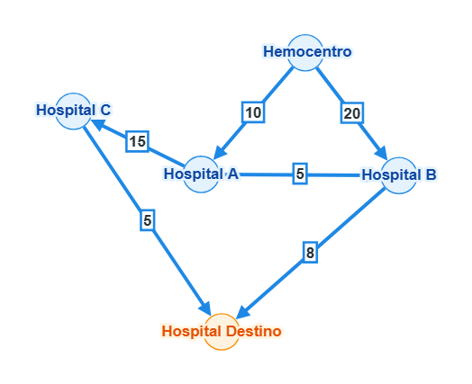

# Evidências da Unidade 1 — Algoritmos e Estruturas de Dados (AED)

Documento consolidado de evidências da **Unidade 1 de AED**, registrando a entrega da **W08** (Revisão do Escopo do Grafo e Consolidação das Estruturas de Dados Implementadas) e a comprovação técnica das estruturas desenvolvidas para o sistema **Rota Vital**.

**Verificado em:** 06/10/2026  
**Repositório:** `rsc3-pixel/Projeto3-2026.2`  
**Disciplina:** Algoritmos e Estruturas de Dados (AED) — Unidade 1  
**Entrega:** W08 (Revisão do escopo do grafo, integração e evidências da U1)

---

## 1. Visão Geral da Entrega de AED U1

Ao longo da Unidade 1, a equipe projetou, implementou e validou em memória as estruturas fundamentais para viabilizar a alocação logística de hemocomponentes com priorização FEFO (*First Expired, First Out*) e cálculo de caminho mínimo na rede de distribuição:

| Semana / Marco | Foco da Entrega | Artefato Principal | Status |
|---|---|---|:---:|
| **W02** | Modelagem formal do grafo viário e definição do escopo | [`docs/W02-escopo-grafo-rede-distribuicao.md`](W02-escopo-grafo-rede-distribuicao.md) | ✅ Concluído e Revisado |
| **W04** | Implementação das estruturas-base em memória (`Grafo`, `FEFO`, `IndiceEstoque`) | [`docs/W04-estruturas-base.md`](W04-estruturas-base.md) | ✅ Concluído |
| **W06** | Análise de topologia da rede viária e diferenças estruturais | [`docs/W06-topologia-diferencas.md`](W06-topologia-diferencas.md) | ✅ Concluído |
| **W08** | Revisão do escopo do grafo, rastreabilidade código-especificação e evidências U1 | [`docs/W08-revisao-escopo-grafo.md`](W08-revisao-escopo-grafo.md) e este documento | ✅ Concluído |

---

## 2. Estrutura 1: Grafo Ponderado e Dirigido em Memória

**Arquivo:** [`src/main/java/com/rotavital/estruturas/Grafo.java`](../src/main/java/com/rotavital/estruturas/Grafo.java)  
**Testes:** [`src/test/java/com/rotavital/estruturas/GrafoTest.java`](../src/test/java/com/rotavital/estruturas/GrafoTest.java) (12 testes unitários, 100% passando)

### 2.1 Representação Adotada
O grafo é implementado em memória como uma **lista de adjacência** baseada em tabelas hash aninhadas:
```java
private final Map<T, Map<T, Double>> adjacencias = new HashMap<>();
private final boolean direcionado;
```
- **Vértices:** O grafo é genérico (`Grafo<T>`), instanciado na malha viária com `T = String` (código identificador da unidade, ex.: `"HC01"`, `"HC06"`).
- **Arestas:** Mapeadas em um `LinkedHashMap<T, Double>` interno que associa cada destino ao tempo estimado de percurso em minutos.
- **Grafo Dirigido:** Por padrão opera como digrafo (`direcionado = true`), refletindo a assimetria real de vias urbanas de mão única, conversões e fluxos de tráfego.

### 2.2 Operações Implementadas e Complexidade

| Operação | Assinatura | Complexidade Média | Descrição |
|---|---|:---:|---|
| Inserir vértice | `inserirVertice(T vertice)` | $O(1)$ | Cria a lista de adjacência se não existir. |
| Inserir aresta | `inserirAresta(T origem, T destino, double pesoMinutos)` | $O(1)$ | Adiciona aresta ponderada e cria vértices automaticamente. Rejeita pesos negativos. |
| Listar vizinhos | `listarVizinhos(T vertice)` | $O(1)$ obtenção, $O(\text{grau}(v))$ percurso | Retorna conjunto não modificável com as chaves dos vizinhos. |
| Vizinhos com peso | `vizinhosComPeso(T vertice)` | $O(1)$ obtenção, $O(\text{grau}(v))$ percurso | Retorna mapa de vizinhos e pesos para consumo direto pelo Dijkstra. |
| Consultar peso | `pesoAresta(T origem, T destino)` | $O(1)$ | Retorna o peso em minutos ou `null` se aresta inexistente. |
| Verificar existência | `contemVertice(T v)`, `contemAresta(T o, T d)` | $O(1)$ | Verificações de presença em tabela hash. |
| Listar vértices | `listarVertices()` | $O(1)$ obtenção, $O(V)$ percurso | Visão do conjunto de todos os vértices cadastrados. |

### 2.3 Validação de Invariante
O método `inserirAresta` valida estritamente pesos não-negativos:
```java
if (pesoMinutos < 0) {
    throw new IllegalArgumentException("Peso nao pode ser negativo: " + pesoMinutos);
}
```
Essa checagem é testada em `GrafoTest#rejeitaPesoNegativo` e garante por construção a pré-condição exigida pelo algoritmo de Dijkstra.

---

## 3. Estrutura 2: Algoritmo de Caminho Mínimo (Dijkstra) e Reconstrução de Rota

**Arquivo:** [`src/main/java/com/rotavital/estruturas/Dijkstra.java`](../src/main/java/com/rotavital/estruturas/Dijkstra.java)  
**Resultado de Rota:** [`src/main/java/com/rotavital/estruturas/ResultadoRota.java`](../src/main/java/com/rotavital/estruturas/ResultadoRota.java)  
**Testes:** [`src/test/java/com/rotavital/estruturas/DijkstraTest.java`](../src/test/java/com/rotavital/estruturas/DijkstraTest.java) e [`DijkstraCasosSemSolucaoTest.java`](../src/test/java/com/rotavital/estruturas/DijkstraCasosSemSolucaoTest.java)

### 3.1 Mecânica do Algoritmo
- **Fila de Prioridade (Heap Binário):** Utiliza `java.util.PriorityQueue<VerticeDistancia<T>>` ordenada pelo menor tempo acumulado.
- **Fechamento de Vértices:** Mantém `Set<T> visitados = new HashSet<>()`. Quando um vértice é retirado da heap, sua distância mínima definitiva está encontrada, impedindo reprocessamento e garantindo complexidade $O((V + E) \log V)$.
- **Reconstrução de Caminho:** Armazena `Map<T, T> predecessores`. Ao atingir o destino, retrocede pelo caminho até a origem e inverte a lista em $O(V)$.
- **Ausência de Sentinelas Arbitrárias:** O método `calcularDistancias(T origem)` retorna um mapa contendo apenas os vértices alcançáveis. Vértices sem caminho simplesmente não estão presentes no mapa (evita `Double.POSITIVE_INFINITY`).

### 3.2 Validação do Exemplo Teórico da W02
O grafo de 5 nós especificado manualmente na W02 é reproduzido no código de teste (`DijkstraTest#caminhoMinimoW02` e `CriteriosAceiteAlocacaoTest`):
- **Origem:** Hemocentro
- **Destino:** Hospital Destino
- **Caminho Calculado:** `Hemocentro → Hospital A (10 min) → Hospital B (5 min) → Hospital Destino (8 min)`
- **Tempo Total:** **23.0 minutos** ✅ (menor que o caminho direto de 28 min e o caminho via C de 30 min).



---

## 4. Estrutura 3: Fila de Prioridade FEFO (*First Expired, First Out*)

**Arquivo:** [`src/main/java/com/rotavital/estruturas/FilaPrioridadeFefo.java`](../src/main/java/com/rotavital/estruturas/FilaPrioridadeFefo.java)  
**Testes:** [`src/test/java/com/rotavital/estruturas/FilaPrioridadeFefoTest.java`](../src/test/java/com/rotavital/estruturas/FilaPrioridadeFefoTest.java) (4 testes unitários)

### 4.1 Critério de Ordenação e Desempate Determinístico
A fila de prioridade gerencia bolsas de sangue (`Bolsa`) aplicando regra estrita:
1. **1º Critério:** Menor `dataValidade` (bolsas mais próximas do vencimento saem primeiro para minimizar descarte).
2. **2º Critério (Desempate):** Menor `codigoRastreio` em ordem alfanumérica.
```java
Comparator<Bolsa> COMPARADOR = Comparator
        .comparing(Bolsa::getDataValidade)
        .thenComparing(Bolsa::getCodigoRastreio);
```
O critério de desempate garante que execuções repetidas sejam 100% determinísticas, independente da ordem em que o estoque foi alimentado.

### 4.2 Operações Implementadas

| Operação | Complexidade | Descrição |
|---|:---:|---|
| `adicionar(Bolsa bolsa)` | $O(\log n)$ | Insere bolsa na heap e restaura a invariante da árvore binária. |
| `consultarProxima()` | $O(1)$ | Consulta a bolsa no topo da heap sem removê-la. |
| `retirarProxima()` | $O(\log n)$ | Remove a bolsa com menor validade e reorganiza a heap. |
| `estaVazia()` / `tamanho()` | $O(1)$ | Verificações diretas de estado interno. |

---

## 5. Estrutura 4: Índice Hash de Estoque

**Arquivo:** [`src/main/java/com/rotavital/estruturas/IndiceEstoque.java`](../src/main/java/com/rotavital/estruturas/IndiceEstoque.java)  
**Testes:** [`src/test/java/com/rotavital/estruturas/IndiceEstoqueTest.java`](../src/test/java/com/rotavital/estruturas/IndiceEstoqueTest.java) (4 testes unitários)

### 5.1 Chave Composta e Mapeamento
Para evitar varreduras completas no estoque de bolsas, o sistema indexa o inventário por meio de chave composta imutável:
```java
public record ChaveEstoque(GrupoSanguineo grupo, TipoHemocomponente tipo) {}
private final Map<ChaveEstoque, List<Bolsa>> indice = new HashMap<>();
```
- **Localização:** Busca por `(GrupoSanguineo, TipoHemocomponente)` em tempo médio **$O(1)$**.
- **Consumo:** Retorna a lista correspondente em cópia não modificável (`Collections.unmodifiableList`).
- **Remoção:** Localiza a chave em $O(1)$ e remove a bolsa em $O(k)$, onde $k$ é a quantidade de bolsas daquele mesmo tipo/grupo.

---

## 6. Integração do Domínio: Serviço de Alocação e Malha Real

**Serviço:** [`src/main/java/com/rotavital/alocacao/ServicoAlocacaoRota.java`](../src/main/java/com/rotavital/alocacao/ServicoAlocacaoRota.java)  
**Carregador de Malha:** [`src/main/java/com/rotavital/rede/CarregadorMalha.java`](../src/main/java/com/rotavital/rede/CarregadorMalha.java)

### 6.1 Fluxo Integrado de Alocação
O `ServicoAlocacaoRota` orquestra as estruturas de dados sem acoplamento indevido:
1. **Filtro de Candidatas:** Consulta o estoque das unidades buscando bolsas do tipo e grupo sanguíneo solicitados.
2. **Cálculo de Rota via Dijkstra:** Executa `dijkstra.calcularDistancias(unidadeSolicitante)`.
3. **Filtro de Alcance:** Descarta unidades inalcançáveis da rede viária.
4. **Seleção FEFO:** Alimenta as bolsas alcançáveis na `FilaPrioridadeFefo` e retira a de menor validade.
5. **Reconstrução do Trajeto:** Chama `dijkstra.calcularRota(solicitante, unidadeDaBolsa)` e retorna o caminho com tempo total em minutos.

### 6.2 Motivos de Falha Tipados (PI3-57)
Em vez de lançar exceções genéricas, falhas de alocação devolvem motivos explícitos e ordenados por precedência:
- `SEM_ESTOQUE`: nenhuma unidade possui a combinação pedida.
- `TODAS_VENCIDAS`: existem bolsas da combinação, mas nenhuma válida ou com status `DISPONIVEL`.
- `SEM_CAMINHO`: existem bolsas válidas, mas todas em unidades sem rota viária viável a partir da solicitante.

### 6.3 Malha Real de Pernambuco
A malha operacional é carregada a partir de [`dados/unidades_saude.csv`](../dados/unidades_saude.csv) com 12 estabelecimentos de saúde reais (HEMOPE, Hospital da Restauração, IMIP, Hospital das Clínicas UFPE, etc.). As arestas são geradas com conexões k-vizinhos mais próximos e distâncias Haversine ponderadas para tempo viário real.

---

## 7. Quadro Consolidado de Complexidade

| Componente | Operação | Notação Teórica | Complexidade Prática no Rota Vital |
|---|---|:---:|---|
| **Grafo** | Inserir vértice | $O(1)$ médio | $O(1)$ em `HashMap` |
| **Grafo** | Inserir aresta | $O(1)$ médio | $O(1)$ em `LinkedHashMap` |
| **Grafo** | Consultar vizinhos | $O(1)$ obtenção | $O(\text{grau}(v))$ iteração |
| **Grafo** | Espaço em memória | $O(V + E)$ | Linear, malha esparsa de 12 unidades |
| **Dijkstra** | Cálculo de distâncias | $O((V + E) \log V)$ | ~11,5 µs medidos na malha de PE |
| **Dijkstra** | Reconstrução de rota | $O(V)$ | Percorre mapa de predecessores |
| **FEFO** | Inserir bolsa | $O(\log n)$ | Inserção em heap binário |
| **FEFO** | Consultar próxima | $O(1)$ | Consulta à raiz |
| **FEFO** | Retirar próxima | $O(\log n)$ | Desce na heap reorganizando |
| **Índice Hash** | Localizar bolsas | $O(1)$ médio | Busca em tabela hash por par enum |
| **Alocação Total** | Requisição ponta a ponta | $O(B \log B + (V + E) \log V)$ | ~17,1 µs medidos em MacBook Apple Silicon |

---

## 8. Evidência de Execução dos Testes Automatizados

Todos os testes de AED foram executados via Maven Wrapper e apresentaram **100% de aprovação (0 falhas, 0 erros)**.

### 8.1 Execução das Estruturas-Base
Comando de verificação:
```bash
./mvnw.cmd test '-Dtest=GrafoTest,DijkstraTest,DijkstraCasosSemSolucaoTest,FilaPrioridadeFefoTest,IndiceEstoqueTest'
```

**Resultado obtido no build:**
```text
[INFO] -------------------------------------------------------
[INFO]  T E S T S
[INFO] -------------------------------------------------------
[INFO] Running com.rotavital.estruturas.DijkstraCasosSemSolucaoTest
[INFO] Tests run: 12, Failures: 0, Errors: 0, Skipped: 0
[INFO] Running com.rotavital.estruturas.DijkstraTest
[INFO] Tests run: 7, Failures: 0, Errors: 0, Skipped: 0
[INFO] Running com.rotavital.estruturas.FilaPrioridadeFefoTest
[INFO] Tests run: 4, Failures: 0, Errors: 0, Skipped: 0
[INFO] Running com.rotavital.estruturas.GrafoTest
[INFO] Tests run: 12, Failures: 0, Errors: 0, Skipped: 0
[INFO] Running com.rotavital.estruturas.IndiceEstoqueTest
[INFO] Tests run: 4, Failures: 0, Errors: 0, Skipped: 0
[INFO] 
[INFO] Results:
[INFO] 
[INFO] Tests run: 39, Failures: 0, Errors: 0, Skipped: 0
[INFO] 
[INFO] ------------------------------------------------------------------------
[INFO] BUILD SUCCESS
[INFO] ------------------------------------------------------------------------
```

### 8.2 Execução da Integração e Desempenho
Comando de demonstração ponta a ponta:
```bash
./mvnw.cmd test '-Dtest=DemoPontaAPontaTest,MedicaoDesempenhoTest,CriteriosAceiteAlocacaoTest'
```
**Resultado:** Todos os cenários (alocação de bolsa válida com menor tempo, sem estoque, todas vencidas e sem caminho) foram demonstrados e validados com sucesso.

---

## 9. Rastreabilidade Código vs. Especificação

| Especificação da W02 / Critério de Aceite | Classe de Produção | Teste Automatizado |
|---|---|---|
| Grafo dirigido por padrão com pesos não-negativos | [`Grafo.java`](../src/main/java/com/rotavital/estruturas/Grafo.java) | [`GrafoTest.java`](../src/test/java/com/rotavital/estruturas/GrafoTest.java) |
| Caminho mínimo por Dijkstra com heap binário | [`Dijkstra.java`](../src/main/java/com/rotavital/estruturas/Dijkstra.java) | [`DijkstraTest.java`](../src/test/java/com/rotavital/estruturas/DijkstraTest.java) |
| Exemplo de 5 nós (caminho 23 min) | [`Dijkstra.java`](../src/main/java/com/rotavital/estruturas/Dijkstra.java) | [`DijkstraTest.java#caminhoMinimoW02`](../src/test/java/com/rotavital/estruturas/DijkstraTest.java) |
| Grafos desconexos, ciclos e laços | [`Dijkstra.java`](../src/main/java/com/rotavital/estruturas/Dijkstra.java) | [`DijkstraCasosSemSolucaoTest.java`](../src/test/java/com/rotavital/estruturas/DijkstraCasosSemSolucaoTest.java) |
| Ordenação FEFO e desempate determinístico | [`FilaPrioridadeFefo.java`](../src/main/java/com/rotavital/estruturas/FilaPrioridadeFefo.java) | [`FilaPrioridadeFefoTest.java`](../src/test/java/com/rotavital/estruturas/FilaPrioridadeFefoTest.java) |
| Indexação por chave composta em $O(1)$ | [`IndiceEstoque.java`](../src/main/java/com/rotavital/estruturas/IndiceEstoque.java) | [`IndiceEstoqueTest.java`](../src/test/java/com/rotavital/estruturas/IndiceEstoqueTest.java) |
| Malha real com 12 unidades de saúde | [`CarregadorMalha.java`](../src/main/java/com/rotavital/rede/CarregadorMalha.java) | [`CarregadorMalhaTest.java`](../src/test/java/com/rotavital/rede/CarregadorMalhaTest.java) |
| Integração FEFO + Dijkstra + Falhas | [`ServicoAlocacaoRota.java`](../src/main/java/com/rotavital/alocacao/ServicoAlocacaoRota.java) | [`CriteriosAceiteAlocacaoTest.java`](../src/test/java/com/rotavital/alocacao/CriteriosAceiteAlocacaoTest.java) |

---

## 10. Referências

| Arquivo | Descrição |
|---|---|
| [`docs/W02-escopo-grafo-rede-distribuicao.md`](W02-escopo-grafo-rede-distribuicao.md) | Documento original de escopo de grafo revisado na W08 |
| [`docs/W04-estruturas-base.md`](W04-estruturas-base.md) | Documentação de entrega das estruturas-base de AED |
| [`docs/complexidade-estruturas.md`](complexidade-estruturas.md) | Análise aprofundada de complexidade algorítmica |
| [`docs/W08-revisao-escopo-grafo.md`](W08-revisao-escopo-grafo.md) | Registro específico da tarefa da entrega W08 |
| [`docs/img/W02-grafo-rede-distribuicao.png`](img/W02-grafo-rede-distribuicao.png) | Diagrama visual do grafo de exemplo da W02 |
