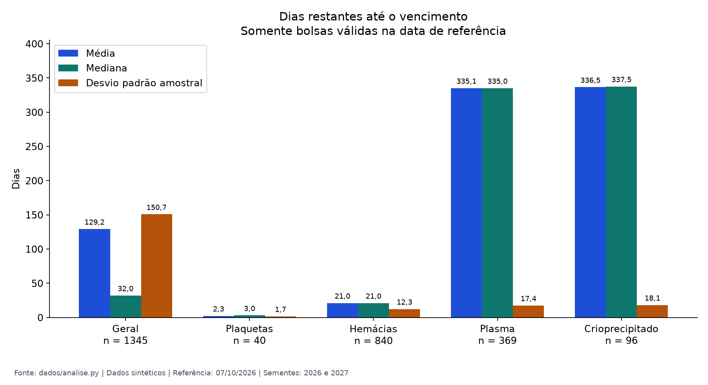
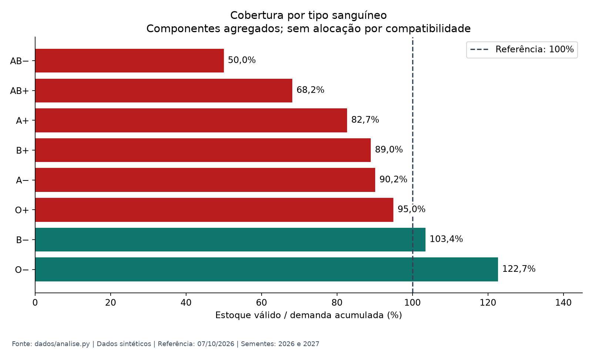

# EST U1 — Sumário executivo e evidências CRISP-DM

**Projeto:** Rota Vital · **Disciplina:** Estatística e Probabilidade · **Compilação:** 07/10/2026

## Sumário executivo

A análise sintética mostra **estoque válido insuficiente e risco de vencimento concentrado nos componentes de menor validade**. Das 2.000 bolsas geradas, 1.345 estão válidas para uma demanda acumulada de 1.487 bolsas em 300 requisições: razão global de **90,5%**. Seis dos oito tipos sanguíneos apresentam cobertura abaixo de 100%. AB− tem a menor cobertura (50,0%), enquanto A+ concentra o maior déficit absoluto (95 bolsas).

A validade restante média é de **129,2 dias**, com **desvio padrão amostral de 150,7 dias** e mediana de apenas **32,0 dias**. A mistura de componentes com validades distintas eleva a média geral; ela não representa dias de abastecimento garantido. Entre as bolsas válidas, **187 (13,9%) vencem em até sete dias**, o que sustenta a priorização por validade (FEFO).

As decisões propostas são acompanhar validade por componente, priorizar as bolsas próximas do vencimento e planejar reposição considerando tanto a cobertura percentual quanto o déficit absoluto. A distribuição territorial também merece atenção: Jaboatão dos Guararapes apresenta saldo de −350 bolsas, frente a +157 em Recife e +51 em Olinda. A análise estabelece uma linha de base; **não comprova redução de descarte nem melhoria de atendimento pelo sistema**.

## Recorte e método

Resultados recalculados a partir de [analise.py](../dados/analise.py), com as [premissas do gerador](../dados/premissas.py), e confrontados com o [snapshot original](../dados/resultados.json). Todas as métricas coincidem na precisão publicada de uma casa decimal. A [evidência numérica](img/est-u1/resultados-verificados.json) preserva os valores sem arredondamento dos cálculos.

- Base exclusivamente sintética: 2.000 bolsas, 300 requisições, 12 unidades (4 hemocentros e 8 agências transfusionais).
- Referência fixada nesta reprodução: **07/10/2026**. Coletas e requisições sorteadas de **08/08/2026 a 07/10/2026**, inclusive (deslocamentos de 0 a 60 dias).
- Sementes: **2026 para bolsas e 2027 para requisições**. Fixar a data torna também as datas geradas reproduzíveis; não indica coleta de dados reais nesse período.
- Bolsa válida: vencimento igual ou posterior à referência; portanto, zero dias restantes entra no cálculo. Bolsas vencidas são excluídas da validade e da cobertura.
- Média: soma dos dias restantes dividida por `n`. Desvio padrão **amostral**: `s = √[Σ(x − média)² / (n − 1)]`, conforme `statistics.stdev`.
- Cobertura: `100 × bolsas válidas do tipo / quantidade demandada do tipo`. Demanda soma as quantidades dos itens de todas as requisições; não é a contagem de requisições. Sem demanda, o indicador seria indefinido (`null`).
- Déficit por tipo: `máximo(0, demandado − disponível)`. Percentuais calculados antes do arredondamento.

## Média e dispersão da validade

| Recorte | Bolsas válidas (n) | Média (dias) | Mediana (dias) | Desvio padrão amostral (dias) |
|---|---:|---:|---:|---:|
| **Geral** | **1.345** | **129,2** | **32,0** | **150,7** |
| Concentrado de plaquetas | 40 | 2,3 | 3,0 | 1,7 |
| Concentrado de hemácias | 840 | 21,0 | 21,0 | 12,3 |
| Plasma fresco congelado | 369 | 335,1 | 335,0 | 17,4 |
| Crioprecipitado | 96 | 336,5 | 337,5 | 18,1 |

Amplitude observada no conjunto válido: **0 a 365 dias**. A distância entre média e mediana e a mistura dos componentes evidenciam a limitação da média global. O desvio padrão maior que a média, isoladamente, não demonstra assimetria. O desvio descreve dispersão; não é intervalo de confiança nem margem de erro.



**Figura 1.** Medidas em dias, calculadas somente sobre bolsas válidas. As três barras representam estatísticas distintas, e não limites de validade.

## Cobertura por tipo sanguíneo

| Tipo | Disponível (bolsas válidas) | Demandado (bolsas) | Cobertura | Déficit (bolsas) | Situação |
|---|---:|---:|---:|---:|---|
| AB− | 5 | 10 | 50,0% | 5 | Abaixo de 100% |
| AB+ | 30 | 44 | 68,2% | 14 | Abaixo de 100% |
| A+ | 454 | 549 | 82,7% | 95 | Abaixo de 100% |
| B+ | 105 | 118 | 89,0% | 13 | Abaixo de 100% |
| A− | 110 | 122 | 90,2% | 12 | Abaixo de 100% |
| O+ | 492 | 518 | 95,0% | 26 | Abaixo de 100% |
| B− | 30 | 29 | 103,4% | 0 | Excedente aritmético de 1 |
| O− | 119 | 97 | 122,7% | 0 | Excedente aritmético de 22 |
| **Total** | **1.345** | **1.487** | **90,5%** | **165¹** | **6 tipos abaixo de 100%** |

¹ Soma dos déficits individuais: 165 bolsas. A falta líquida global é de **142 bolsas** (1.487 − 1.345), pois existem 23 bolsas de excedente aritmético em outros tipos. A cobertura global é a razão entre os totais, não a média simples dos oito percentuais.



**Figura 2.** Vermelho identifica cobertura abaixo de 100%; verde indica razão acima de 100%. A linha tracejada marca a igualdade entre estoque e demanda.

**Limite da interpretação:** o cálculo agrega os quatro componentes e compara um estoque pontual com pedidos acumulados. Não considera atendimento anterior, compatibilidade entre tipos, correspondência por componente, deslocamento, prazo ou temperatura. Logo, excedente aritmético não garante atendimento, e cobertura não é taxa de pedidos efetivamente atendidos. Não se presume que bolsas O− de quaisquer componentes possam suprir os demais déficits.

## Vencimento e prioridades de gestão

| Componente | Bolsas geradas | Vencidas | Proporção vencida |
|---|---:|---:|---:|
| Concentrado de plaquetas | 407 | 367 | 90,2% |
| Concentrado de hemácias | 1.128 | 288 | 25,5% |
| Plasma fresco congelado | 369 | 0 | 0,0% |
| Crioprecipitado | 96 | 0 | 0,0% |
| **Total** | **2.000** | **655** | **32,8%** |

O código chama essa proporção de “taxa de descarte”, mas mede bolsas vencidas em uma fotografia sintética, sem simular consumo ou reposição contínuos. Não há registro de descarte realizado. As premissas são didáticas e esses percentuais não estimam a realidade de um hemocentro.

| Evidência | Decisão proposta | Como avaliar posteriormente |
|---|---|---|
| 187 bolsas válidas vencem em até 7 dias | Priorizar FEFO e acompanhar validade por componente | Comparar vencimento com e sem FEFO sob a mesma demanda |
| AB−: 50,0%; A+: déficit de 95 bolsas | Planejar reposição por percentual e volume, detalhando componente e unidade | Medir atendimento efetivo por tipo e componente |
| Jaboatão: saldo −350 bolsas | Avaliar redistribuição a partir da disponibilidade nas outras cidades | Verificar alocação, rotas e cumprimento de prazos |

## Rastreabilidade CRISP-DM da entrega

| Fase | Evidência e alcance nesta compilação |
|---|---|
| 1. Entendimento do negócio | Reduzir vencimento e falta de estoque; objetivo descrito no [briefing](../dados/crisp-dm-briefing.md) |
| 2. Entendimento dos dados | Estatística descritiva, cobertura e comparação territorial consolidadas neste documento |
| 3. Preparação dos dados | [Gerador de bolsas](../dados/gerar_bolsas.py), [gerador de requisições](../dados/gerar_requisicoes.py), sementes fixas, filtro de validade e agregação das quantidades |
| 4. Modelagem | Esta entrega consolida o baseline descritivo; não apresenta modelo preditivo ou experimento comparativo |
| 5. Avaliação | Conferência numérica com o snapshot concluída; avaliação do efeito das regras de decisão permanece fora desta análise |
| 6. Implantação/comunicação | Sumário, gráficos e dados auditáveis disponíveis no repositório; a portabilidade dos indicadores para a API é documentada em [interpretação dos indicadores](interpretacao_indicadores.md) |

O [pitch original](../apresentacao/pitch-crisp-dm.html) complementa a apresentação. Seus planos de fases posteriores refletem o contexto em que foi produzido. Os números desta entrega são do gerador Python, não da carga inicial de 100 bolsas da API.

## Reprodução das evidências

Na raiz do repositório, com Python 3 e um ambiente Python de sua preferência:

```powershell
python -m pip install -r dados/requirements-est-u1.txt
python dados/evidencias_est_u1.py
```

O script fixa a referência, recalcula as métricas usando as funções existentes, compara todas as métricas com `dados/resultados.json` a uma casa decimal e interrompe a geração se houver divergência. Em seguida, grava os dois gráficos PNG e o JSON com valores completos em `docs/img/est-u1/`. Os artefatos já estão incluídos para leitura sem instalar dependências.

Para conferir apenas a análise textual, sem Matplotlib: `python dados/analise.py`. Esse comando usa a data local atual, mas mantém os indicadores relativos da simulação pelas sementes fixas.
